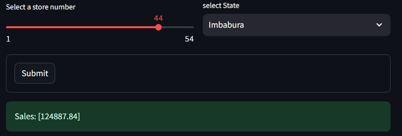

### Deployment of Machine Learning models

## Streamlit App - Store Sales Prediction for Corporation Favorita

Welcome to Machine Learning Model Embedding Project using Streamlit! This project demonstrates how to embed a machine learning model to predict store sales for Corporation Favorita, a large Ecuadorian-based grocery retailer. The Streamlit app provides an interactive interface for users to input features and obtain sales predictions of products.

### Article
| Code      | Name        | Published Article |  Deployed App |
|-----------|-------------|:-------------:|------:|
| LP4  | Medium |  [https://medium.com/@benjaminkipkem/building-a-machine-learning-model-with-streamlit-8e28ea8516a0](/) | [Best Article Machine learning](/) |

### Usage

To use the Streamlit app for store sales prediction, follow these steps:

1. Install the required dependencies (see Installation section below).
2. Run the Streamlit app: `app.py`.
3. Input relevant variables for store_nbr, family, onpromotion, Oil_prices, city,	state, day_of_week etc.

The app will display the predicted sales output for the specified input variables as shown in the image above.

### Installation

To run the Streamlit app locally for store sales prediction, follow these steps:

1. Clone this repository: `https://github.com/kaitany/Streamlit_Project-Embedding-a-ML_Model-into-GUI.git`
2. Navigate to the project folder: `cd your_repository`
3. Install the required dependencies: `pip install -r requirements.txt`
4. Run the Streamlit app: `app.py`

## Contributing

Contributions are welcome! If you find any issues or have suggestions, please feel free to open an issue or submit a pull request.

## License

This project is licensed under the [<https://www.gnu.org/licenses/>](LICENSE).

---

  Made by Benjamin Kaitany

